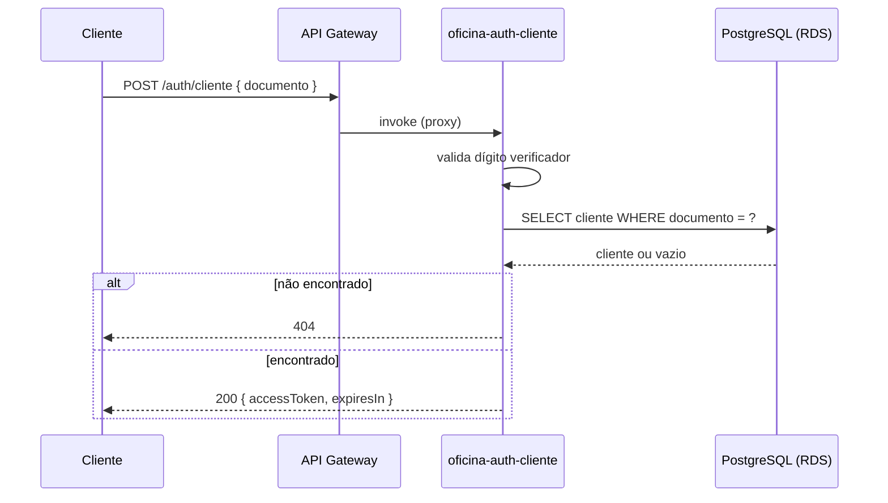

# oficina-auth-cliente (Lambda)

Function Serverless (AWS Lambda) responsável pela autenticação de clientes por
CPF/CNPJ — repositório 1 de 4 do Tech Challenge Fase 3. Fica atrás de um API Gateway
HTTP API público; o [app principal](https://github.com/RafaelNikolasPuggi/oficina-tech-challenge)
consome o JWT que ela emite para proteger as rotas voltadas ao cliente final.

## Deploy ativo

> Roda sob demanda para conter custo — se não responder, o ambiente foi
> desligado (`terraform destroy`) após a gravação da demonstração.

```bash
curl -X POST https://wq5yeux4ge.execute-api.us-east-1.amazonaws.com/auth/cliente \
  -H "Content-Type: application/json" \
  -d '{"documento":"111.444.777-35"}'
```

## O que faz

`POST /auth/cliente` com `{ "documento": "<CPF ou CNPJ>" }`:

1. Valida o dígito verificador do documento (400 se inválido).
2. Consulta a existência do cliente na base (mesmo Postgres do app principal, via RDS).
3. 404 se não encontrado.
4. 200 com `{ accessToken, expiresIn }` se encontrado — um JWT de curta duração
   (`tipo: "cliente"`, `sub: <clienteId>`) assinado com um segredo compartilhado com o
   app principal via SSM Parameter Store.

## Tecnologias

Node.js 20 + TypeScript, `pg` (conexão direta ao RDS, uma conexão por container —
prática recomendada para Lambda), `jsonwebtoken`, Jest.

## Rodando e testando localmente

```bash
npm install
npm test           # unitários: validação de CPF/CNPJ + handler (DB mockado)
npm run test:cov
npm run build       # compila para dist/
```

Não é necessário AWS nem banco de dados para rodar os testes — `buscarClientePorDocumento`
é mockado em `src/handler.spec.ts`.

## Infraestrutura (Terraform)

Ver [`infra/`](infra). Publica o segredo JWT no SSM (`/oficina/jwt_secret`) e lê, do
mesmo SSM, o que os outros repositórios publicaram: VPC/subnets
(`oficina-infra-k8s`) e endpoint/credenciais do banco (`oficina-infra-db`) — aplique
esses dois primeiro. Ver ADR 0006 no repositório principal para o porquê dessa
integração via SSM em vez de `terraform_remote_state` direto entre repositórios.

```bash
npm run build
npm run package      # gera function.zip (dist/ + node_modules de produção)
cd infra
terraform init
terraform apply
```

Saída relevante: `api_endpoint` — a URL pública da rota `POST {api_endpoint}/auth/cliente`.

## Diagrama


